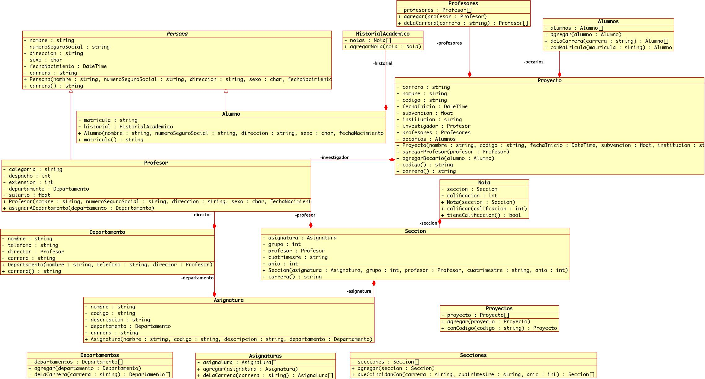

# Ejercicio Universidad

La **universidad** mantiene la siguiente información:

* Para cada **persona** se guarda su nombre, número de seguridad social,
dirección, sexo y fecha de nacimiento.
* Para los **alumnos** se tiene la carrera, las secciones en las que está o
estuvo inscrito  y las **notas** que ha recibido en cada asignatura.
* Para cada **asignatura** se mantiene su nombre, código, descripción y
departamento.
* Cada nuevo cuatrimestre se pueden organizar varios grupos de la misma
asignatura (**secciones**). Para cada uno se guarda la asignatura, el
número de grupo, el profesor responsable (único) de la asignatura de ese
grupo junto al cuatrimestre y año en el que se impartió.
* Para los **profesores** además se tiene su categoría (HC *hora clase*, TC
*tiempo completo*, MT *medio tiempo*), número de despacho, extensión,
departamento y salario.
* **Proyectos** de investigación realizados por el profesorado y becarios.
Para cada uno se guarda su nombre, código, fecha de inicio, subvención
obtenida (ayuda económica), entidad que subvenciona, investigador principal
(profesor) y profesores y becarios participantes.
*  Para cada **departamento** se guarda su nombre, teléfono, y quien es su
director (un profesor).

Usando el siguiente diagrama de clases comom base:



Escribir una aplicación de consola con las siguientes características:

* Debe incluir el siguiente menú principal
```
[1] Agregar alumno
[2] Agregar profesor
[3] Agregar asignatura
[4] Agregar departamento
[5] Agregar sección
[6] Inscribir alumno
[7] Historial académico
[8] Agregar proyecto
[9] Salir
Ingresa el número de la opción que deseas:
```
* Si se selecciona la opción `Agregar alumno ` el usuario debe ser capaz
de capturar los siguientes datos:
```
Nombre:
No. de seguro social:
Dirección:
Sexo (M/F):
Fecha de nacimiento (aaaa-mm-dd):
Carrera:
Matrícula:
```
* Si se selecciona la opción `Agregar profesor` el usuario debe ser capaz de
capturar los siguientes datos:
```
Nombre:
No. de seguro social:
Dirección:
Sexo (M/F):
Fecha de nacimiento (aaaa-mm-dd):
Carrera:
Categoria (HC, TC, MT):
Despacho:
Extensión:
Salario mensual:
```
* Si se selecciona la opción `Agregar asignatura` el usuario debe ser
capaz de capturar los siguientes datos:
```
Nombre:
Código:
Descripción:
Carrera:
Departamento:
[1] Programación
[2] Matemáticas
[3] Electrónica
```
Una vez que el usuario ingrese el dato de la carrera, en la opción
departamento solo deben aparecer departamentos de la carrera ingresada.
* Si se selecciona la opción `Agregar departamento` el usuario debe ser
capaz de capturar los siguientes datos:
```
Nombre:
Teléfono:
Carrera:
Director:
[1] Juan Pérez
[2] Fulano de tal
[3] José López
```
Una vez que el usuario ingrese el dato de la carrera, en la opción director
solo deben aparecer profesores de la carrera ingresada.
* Si se selecciona la opción `Agregar sección` el usuario debe ser
capaz de capturar los siguientes datos:
```
Carrera:
Grupo:
Cuatrimestre (Primavera/Verano/Otoño):
Año:
Asignatura:
[1] Programacion I
[2] Análisis y diseño de algoritmos
[3] Aplicaciones Web
Profesor:
[1] Juan Pérez
[2] Fulano de tal
[3] José López
```
La aplicación solo debe mostrar asignaturas y profesores de la carrera que
haya ingresado el usuario.
* Si se selecciona la opción `Inscribir alumno` el usuario debe ser
capaz de capturar los siguientes datos:
```
Carrera:
Cuatrimestre (Primavera/Verano/Otoño):
Año:
Seccion:
[1] Programacion I -  Juan Pérez
[2] Análisis y diseño de algoritmos - Fulano de tal
[3] Aplicaciones Web - José López
```
La aplicación solo debe mostrar secciones para la carrera, año y cuatrimestre proporcionado por el usuario.
* Si se selecciona la opción `Historial académico` el usuario debe ser
capaz de capturar los siguientes datos:
```
Matricula:
```
Las asignaturas y calificaciones deben salir de la más antigua a la más
reciente.
* Si se selecciona la opción `Agregar proyecto` el usuario debe ser
capaz de capturar los siguientes datos:
```
Carrera:
Nombre:
Código:
Fecha de inicio:
Subvención $:
Insitución:
Investigador:
[1] Juan Pérez
[2] Fulano de tal
[3] José López
```
Solamente deben mostrarse profesores de la carrera seleccionada.
